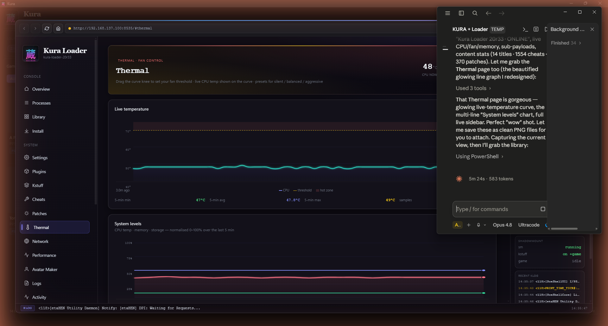

# Kura

Kura is a free Windows application that scans your drives, identifies every PlayStation game you own, and helps you organise, transfer, and install them — across PS1, PS2, PSP, PS3, PS4, PS5, and PS Vita, in a single library.

No installer. No login. No account. A portable `.exe`.

![Kura — unified PlayStation library]

## Download

Download the latest `kura.exe` from the [Releases](https://github.com/NookieAI/kura/releases/latest) page and run it — no installation, no administrator rights, no Node.js.

Each release also includes `kura-loader.elf`, the Kura Loader payload for PS5 (see [Kura Loader](#kura-loader) below).

## Features

- **Reads inside the files.** Kura parses the PKG header, the ISO9660 directory, the SFO metadata, the ZIP central directory, and the CSO sector index to extract the real title, title ID, version, content ID, region, firmware requirement, and cover art. `FF7-REMAKE-PS4-FIXED-FIXED2.pkg` is identified as *Final Fantasy VII Remake*.
- **Every PlayStation in one library.** PS1 disc images, PS2 ECM dumps, PSP UMDs and CSOs, PS3 JB folders and PKGs, PS4 fpkg/exFAT backups, PS5 folder installs, and PS Vita VPKs — the same library, filters, and workflow throughout.
- **Fast scanning.** Drives scan in parallel, and compressed formats use partial decompression (reading only the sectors needed for metadata), so a 1.8 GB CSO scans about as quickly as a plain ISO.
- **Structural identification.** Games are classified by format-defined fields — the SFO TITLE_ID prefix, the PNG icon signature, the BOOT line in SYSTEM.CNF — not by filename.
- **Layout presets.** Built-in presets for Itemzflow, webMAN, etaHEN, Dump Runner, GoldHEN, and others, plus a custom rename builder.
- **Direct console transfer.** Transfer over FTP straight to the console and install packages through the correct endpoint for your firmware. PS5 transfers respect the PS5 FTP daemon's throttling to avoid stalls.
- **Duplicate detection.** Groups the same game across drives, versions, and regions (by content ID, version, and region) and shows the differences side by side.

## Kura Loader

Kura Loader is the companion PS5 payload, distributed as `kura-loader.elf` and included with every release. It is a single, self-contained ELF: one payload to load on a jailbroken PS5 that provides a web dashboard together with a complete jailbreak toolset, with no additional downloads. The desktop application communicates with it over the local network to enable Kura's PS5 features.

When you connect a jailbroken PS5 that does not yet have it, Kura can fetch, push, and launch `kura-loader.elf` automatically. You can also trigger this on demand from **Menu → Set up my PS5**.

### ShadowMountPlus

Kura Loader bundles and manages [ShadowMountPlus](https://github.com/drakmor/shadowMountPlus) by Drakmor, a mount engine that allows the PS5 to run titles directly from external, USB, or network storage without first copying them to the internal SSD. Mount a game to play it, and unmount it when finished — a practical way to maintain a large library on a console with limited internal space. Kura keeps ShadowMountPlus updated to the latest build.

### Included tools

A jailbreak toolset in a single payload, operated from the dashboard or the desktop application:

- **Installation** — PKG install and upload, URL-push install, disc and folder installs, and tile auto-install, for both PS4 and PS5 packages.
- **Game library and app dumper** — reads the console's own database for real titles, and can dump installed games back out.
- **Cheats and patches** — a built-in cheats engine (1,500+ cheats) and game patches (370+), with optional auto-fetch.
- **Save manager** — back up and restore game saves (Garlic save-manager integration).
- **Fan control and thermals** — live CPU temperature, custom fan curves, and silent / balanced / aggressive presets.
- **Avatar maker** — set custom PSN profile avatars.
- **Network tools** — LAN auto-discovery (mDNS), SMB shares, nanoDNS, and network diagnostics.
- **Plugins and kernel log** — load plugins and stream the live kernel log for debugging.
- **Health and recovery** — process monitor, crash logs, safe mode, and a built-in `elfldr` so Kura can relaunch the payload if it stops.

### Dashboard

Open the dashboard from Kura (**Menu → Kura Dashboard**) or in any browser at `http://<console-ip>:8535/`. It provides a live view of the console — temperatures and fan, memory and storage, processes, library, installs, cheats, patches, save manager, network, and logs — updated in real time.

### Requirements and setup

- Included with each [release](https://github.com/NookieAI/kura/releases/latest) as `kura-loader.elf`; the app's **Menu → Update kura.elf from GitHub** and the automatic setup keep it current.
- Requires a jailbroken PS5 on compatible firmware with a payload loader (for example, etaHEN). Open the console from Kura, or let the automatic setup handle it.
- A full walkthrough is available in the app under **Menu → Help & Guide → "Set up your PS5"**.

PS5 console features are optional; the desktop application's scanning, organisation, and metadata features run on any Windows PC without them.

### Credits

Kura Loader builds on the work of the PS5 homebrew community, most notably [ShadowMountPlus](https://github.com/drakmor/shadowMountPlus) by Drakmor and the wider ps5-payload-dev ecosystem. Thanks to everyone who develops and shares these tools.

## Supported formats

ISO, BIN/CUE, IMG, CHD, CSO/ZSO, ECM, PBP, PKG (PS3/PS4/PS5), fpkg, exFAT game images, folder dumps, VPK, and compressed archives (ZIP, RAR, 7z) — scanned in place using partial decompression.

## Privacy

Core operation is fully offline. The only optional online requests are cover-art and GameDB lookups, which you initiate. There is no telemetry, no account, and no background connectivity.

## Platform

Windows, distributed as a portable `.exe`. macOS and Linux are not officially supported (Wine may work but is untested).

## Links

- In-app Help & Guide (**Menu → Help & Guide**) — full walkthrough, layouts, console setup, and troubleshooting.
- [Issues](https://github.com/NookieAI/kura/issues) — bug reports and feature requests.
- Discord — the invite link is available from the **Discord** button in the application.

---

Kura is built and maintained by Nookie.
